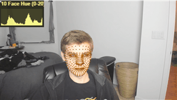

# [LifeLens](https://zalo.github.io/LifeLens/)

  
  
  

 A quick and _extremely_ dirty test for reading facial bloodflow via webcam (eventually for detecting heartrate).

## Basic Algorithm
 - Get a Bounding Box of the Face
 - Average up the R and G components of all the pixels in the box
 - Divide the Red Channel by the Green Channel
 - Crop to a fixed range and add filtering

 ## Limitations
 - Needs strong ambient illumination
 - Results may be skin color dependent

 ## Credits
 - [three.js](https://github.com/mrdoob/three.js/) (3D Rendering Engine)
 - [Mediapipe Facemesh](https://github.com/tensorflow/tfjs-models/tree/master/face-landmarks-detection) (Face Tracking)
